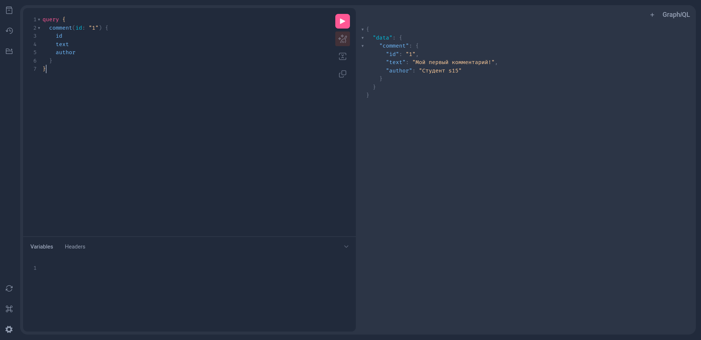

# Лабораторная работа №5: GraphQL API

**Студент:** Любимов Кирилл Алексеевич (s15)  
**Группа:** 331  
**Ресурс:** comments (комментарии)  
**Дополнительное поле:** author (автор)

## Описание задания

Реализовать GraphQL API для работы с комментариями. API должен поддерживать:
- Получение списка всех комментариев
- Получение одного комментария по ID
- Создание нового комментария

## Реализация

### GraphQL схема (`app/schema.graphql`)

```graphql
type Comment {
    id: ID!
    text: String!
    author: String!
}

type Query {
    comments: [Comment!]!
    comment(id: ID!): Comment
}

input CreateCommentInput {
    text: String!
    author: String!
}

type Mutation {
    createComment(input: CreateCommentInput!): Comment!
}
```

### Сервер (`app/main.py`)

Реализован на основе:
- **FastAPI** — веб-фреймворк
- **Strawberry GraphQL** — библиотека для GraphQL
- **Uvicorn** — ASGI сервер

Основные компоненты:
- `Comment` — тип данных для комментария
- `CreateCommentInput` — входные данные для создания комментария
- `Query` — резолверы для чтения данных
- `Mutation` — резолверы для изменения данных
- `comments_db` — хранилище данных (список в памяти)

## Запуск

```bash
# Перейти в директорию лабы
cd ~/Code/Network-Software/weeks/week-05

# Активировать виртуальное окружение
source ../../.venv/bin/activate

# Запустить сервер
uvicorn app.main:app --port 8178 --reload
```

Сервер будет доступен по адресу: `http://127.0.0.1:8178/graphql`

## Примеры запросов

### Создание комментария

```graphql
mutation {
  createComment(input: {
    text: "Отличная статья!"
    author: "Кирилл"
  }) {
    id
    text
    author
  }
}
```

### Получение всех комментариев

```graphql
query {
  comments {
    id
    text
    author
  }
}
```

### Получение одного комментария

```graphql
query {
  comment(id: "1") {
    id
    text
    author
  }
}
```

## Скриншот работы GraphiQL



## Проверка

```bash
# Запустить тесты
cd ~/Code/Network-Software
STUDENT_ID=s15 GROUP=331 python -m pytest -q weeks/week-05/tests
```

Все тесты пройдены
